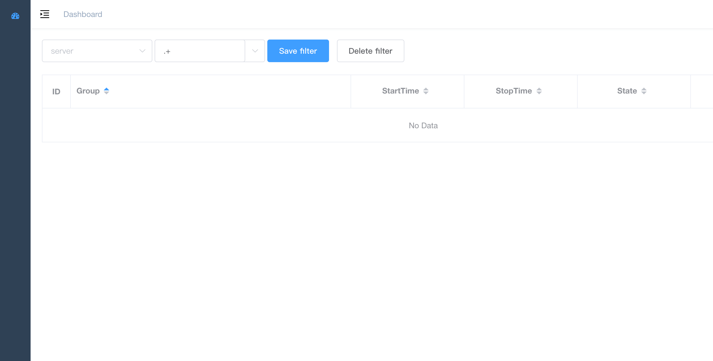

# supervisor-frontend


base on https://github.com/PanJiaChen/vue-admin-template

## 【推荐】和supervisor-backend结合使用，

[supervisor-backend](https://github.com/lizongying/supervisor-backend)

### build

```
npm run build:prod

```

## 如单独部署

* 修改.env.production

```
VUE_APP_BASE_API = '<host>'
```

* 修改vue.config.js

```
outputDir: 'dist',
```

